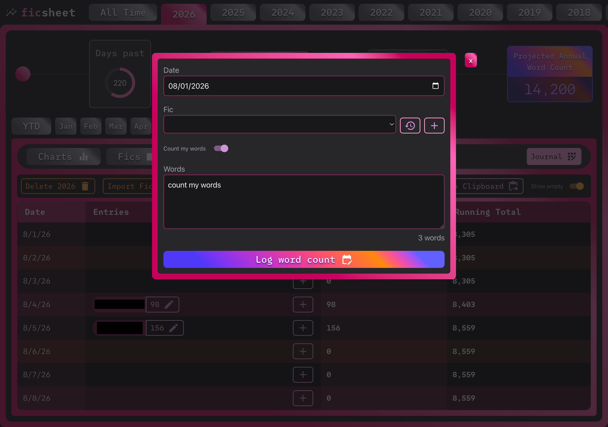
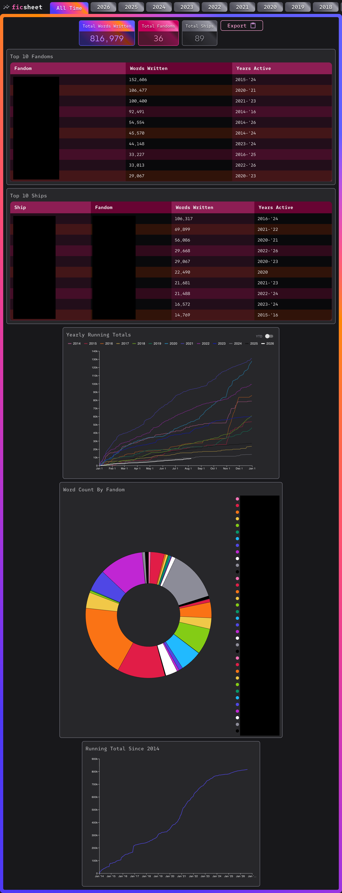

# Ficsheet

A TypeScript/React app to track and visualize periodic writing goals and trends.

## Features:
- **Just paste.** Paste your word count directly into the app and only your daily word count will be stored. None of your writing is stored anywhere!
- **Fic analytics.** Drill down into your writing data and get colorful, dynamic charts and graphs for any year or month.
- **Host your own data.** If you run the app locally, you get all the bells and whistles, but no data leaves your computer. Be sure to save backups in multiple places to prevent data loss.
  > Next up: web hosting for everyone! I'm in the process of tracking down and setting up privacy-first hosting.
- **Export to clipboard.** Copy JSON backups, save them, edit them.
- **Import from file.** Import saved backups. Great for if you need to move devices but want to keep that local-first experience.





## Local development

Running this app locally saves your data in a `.sqlite` file on your computer. No data is sent, sold, or tracked (...by me). You can export this data by going to the History tab and clicking "Export", which will copy your data in a JSON format that may be saved and imported into the app.

```bash
git clone git@github.com:kenziebottoms/ficsheet.git
cd ficsheet
nvm use # if using nvm
npm i
npm start
```

For greater error visibility, you can also run the front and back ends separately.

|Command|Description|
|-------|-----------|
|`npm run dev`|Serve React SPA with `vite` command|
|`npm run serve`|Serve Node Express API with `nodemon` command|
|`npm run start`|Serve both the front- and back-end with `concurrently`|

## Toolbox
- [ESLint](https://eslint.org/)
- [Material UI](https://mui.com/)
- [Tailwind CSS](https://tailwindcss.com/)
- [Vite](https://vite.dev/)

---

## React + TypeScript + Vite Boilerplate documenation

This template provides a minimal setup to get React working in Vite with HMR and some ESLint rules.

Currently, two official plugins are available:

- [@vitejs/plugin-react](https://github.com/vitejs/vite-plugin-react/blob/main/packages/plugin-react) uses [Babel](https://babeljs.io/) (or [oxc](https://oxc.rs) when used in [rolldown-vite](https://vite.dev/guide/rolldown)) for Fast Refresh
- [@vitejs/plugin-react-swc](https://github.com/vitejs/vite-plugin-react/blob/main/packages/plugin-react-swc) uses [SWC](https://swc.rs/) for Fast Refresh

### React Compiler

The React Compiler is not enabled on this template because of its impact on dev & build performances. To add it, see [this documentation](https://react.dev/learn/react-compiler/installation).

### Expanding the ESLint configuration

If you are developing a production application, we recommend updating the configuration to enable type-aware lint rules:

```js
export default defineConfig([
  globalIgnores(['dist']),
  {
    files: ['**/*.{ts,tsx}'],
    extends: [
      // Other configs...

      // Remove tseslint.configs.recommended and replace with this
      tseslint.configs.recommendedTypeChecked,
      // Alternatively, use this for stricter rules
      tseslint.configs.strictTypeChecked,
      // Optionally, add this for stylistic rules
      tseslint.configs.stylisticTypeChecked,

      // Other configs...
    ],
    languageOptions: {
      parserOptions: {
        project: ['./tsconfig.node.json', './tsconfig.app.json'],
        tsconfigRootDir: import.meta.dirname,
      },
      // other options...
    },
  },
])
```

You can also install [eslint-plugin-react-x](https://github.com/Rel1cx/eslint-react/tree/main/packages/plugins/eslint-plugin-react-x) and [eslint-plugin-react-dom](https://github.com/Rel1cx/eslint-react/tree/main/packages/plugins/eslint-plugin-react-dom) for React-specific lint rules:

```js
// eslint.config.js
import reactX from 'eslint-plugin-react-x'
import reactDom from 'eslint-plugin-react-dom'

export default defineConfig([
  globalIgnores(['dist']),
  {
    files: ['**/*.{ts,tsx}'],
    extends: [
      // Other configs...
      // Enable lint rules for React
      reactX.configs['recommended-typescript'],
      // Enable lint rules for React DOM
      reactDom.configs.recommended,
    ],
    languageOptions: {
      parserOptions: {
        project: ['./tsconfig.node.json', './tsconfig.app.json'],
        tsconfigRootDir: import.meta.dirname,
      },
      // other options...
    },
  },
])
```
